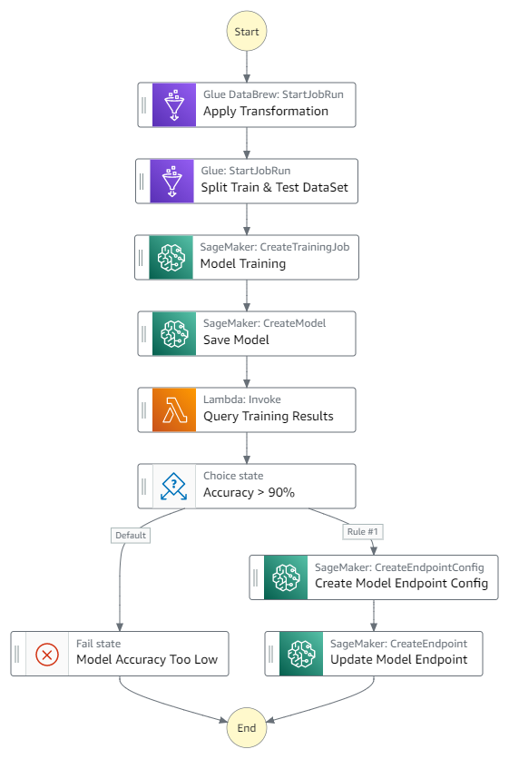

# Sagemaker Model training workflow with AWS Glue Databrew reciepe and AWS Step Function SDK.

# Introduction

As the Industry grows with more data along with large scale adoption of machine learning solutions, cleansing and visualizing data for model training has become key task in the ML workflow. As data scientist and engineers look for more insights from data they also want to reduce time to derive new insights and look for data profiling and transformation capabilities from visual preparation tool.

Recently, AWS announced the general availability of AWS Glue DataBrew, a new visual data preparation tool that helps you clean and normalize data without writing code. This reduces the time it takes to prepare data for analytics and ML by up to 80% compared to traditional approaches to data preparation.

Regarding orchestration or workflow management, AWS provides AWS Step Functions, a serverless function orchestrator that makes it easy to build a workflow by integrating different AWS services like AWS Lambda, Amazon Simple Notification Service (Amazon SNS), AWS Glue, and more. With its built-in operational controls, Step Functions manages sequencing, error handling, retry logic, and states, removing a significant operational burden from your team.

As part of this repository, we walk through a solution where we use DataBrew for visual data preparation and use Jupyterlab code to call databrew artifacts and create AWS step functions to orchestrate Sagemaker training jobs.

## Step function workflow
This is an overview of the architecture described above: 

## Data
The data is related with direct marketing campaigns of a banking institution. The marketing campaigns were based on phone calls. Often, more than one contact to the same client was required, in order to access if the product (bank term deposit) would be ('yes') or not ('no') subscribed.

The dataset we use is publicly available and It is attributed by S. Moro, P. Cortez and P. Rita to the University of California Irvine Repository of Machine Learning Datasets. 

https://archive.ics.uci.edu/ml/datasets/Bank+Marketing

## Solution Steps

First we will create databrew project and receipes to transform dataset then create machine learning model training workflow using Step function. 

You can find more information about Databrew and step function in below links

* [AWS Glue Databrew](https://aws.amazon.com/glue/features/databrew/)
* [AWS Glue Databrew Deverloper Guide](https://docs.aws.amazon.com/databrew/latest/dg/what-is.html)
* [AWS Step Functions](https://aws.amazon.com/step-functions/)
* [AWS Step Functions Developer Guide](https://docs.aws.amazon.com/step-functions/latest/dg/welcome.html)
* [AWS Step Functions Data Science SDK](https://aws-step-functions-data-science-sdk.readthedocs.io)
​

This solution is implemented in Jupyter notebook - here

All required roles/permission can be deployed using cloudformation template - here

we will use the SDK to create steps that Orchestrate AWS Glue Databrew receipe jobs, encorporate this data into the training of a machine learning model, deploy the model to a SageMaker endpoint, link these steps together to create a workflow, and then execute the workflow in AWS Step Functions.

 
## License Summary

This sample code is made available under the MIT-0 license. See the [LICENSE](LICENSE) file.